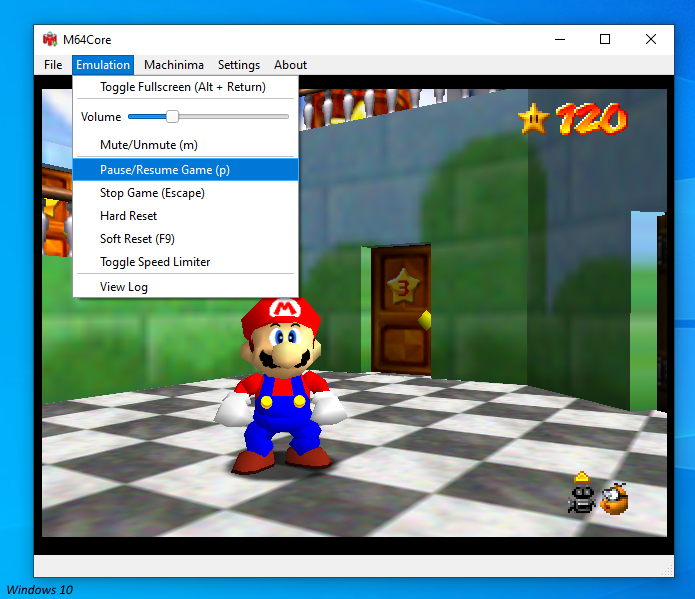

# m64core
M64Core is the first ever cross-platform emulator dedicated to *Super Mario 64* machinima. 
Built with mupen64plus and Qt5.

## Installation
You can download M64Core in our [releases](https://github.com/projectcomet64/m64core/releases) section.
For compilation instructions, please refer to our [wiki](https://github.com/projectcomet64/m64core/wiki).

***

 

## Special Thanks
- [mupen64plus](https://github.com/mupen64plus)
- loganmc10 (creator of [m64p](https://m64p.github.io/) and [mupen64plus-gui](https://github.com/m64p/mupen64plus-gui))
- GlitchyPSI (creator of [M64MM3](https://github.com/projectcomet64/M64MM))
